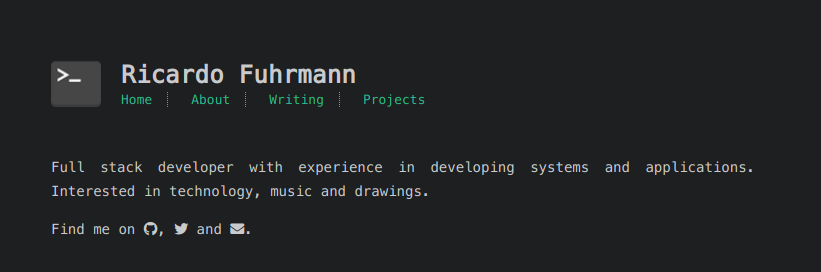

This is my personal website/blog developed with [Hexo](https://hexo.io).

You can check it out here: https://ricardof.dev

## Start

1. Copy the `.env.example` to `.env` and edit the variables inside.
2. Install the dependencies: `docker-compose run --rm node install`
3. Start the hexo container: `docker-compose up -d --build hexo`

## Build and deploy

Just run `docker-compose exec hexo hexo clean && hexo deploy`

It will deploy to the `master` branch.